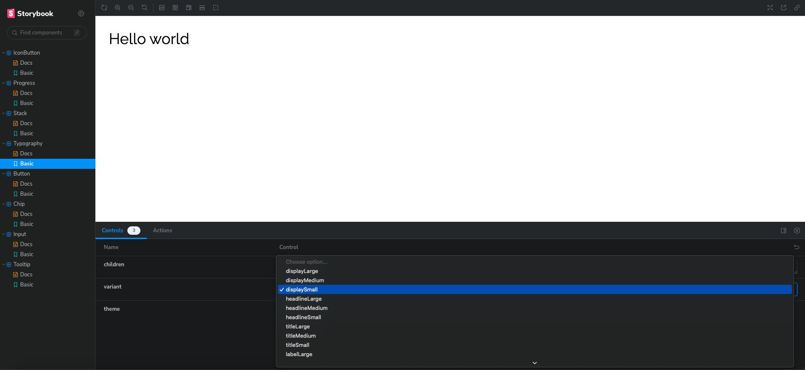
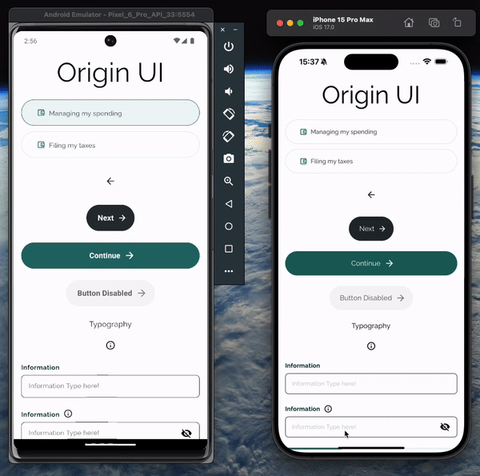

# getting started

```sh
 yarn install
```

# how to run for tests

```sh
yarn start
```

## android

```sh
yarn android
```

## ios

```sh
yarn ios
```

### how to run story book

```sh
# either
yarn storybook

# ios
yarn storybook:ios

# android
yarn storybook:android
```

If you add new stories on the native (ondevice version) you either need to have the watcher running or run the stories loader

To update the stories one time

```sh
yarn storybook-generate
```

# Web

Start react native web storybook:

```
yarn storybook:web
```

build react native web storybook:

```sh
yarn build-storybook
```
